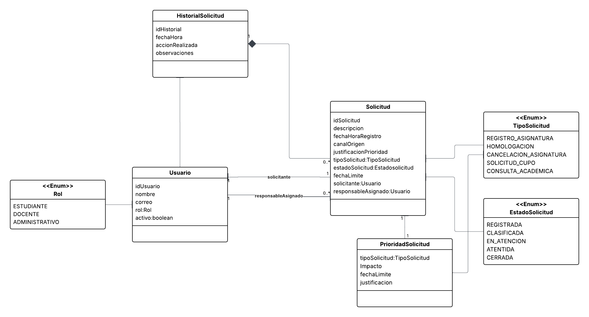

## README: API de Gestión de Solicitudes Académicas
Este documento describe la arquitectura y el funcionamiento de la API para la gestión de solicitudes académicas. El sistema está diseñado para digitalizar y automatizar el flujo de trabajo de peticiones como registro de asignaturas, homologaciones, solicitudes de cupo, entre otras, incorporando capacidades de inteligencia artificial para asistir en la clasificación y generación de resúmenes.

#### 1. Modelo de Datos 
El núcleo del sistema se basa en las siguientes entidades:

  - Solicitud: Es la entidad principal del sistema. Representa una petición hecha por un usuario. 
  
  - Usuario: Representa a todas las personas que interactúan con el sistema, Un usuario puede ser el solicitante o el responsableAsignado.
  
 -  HistorialSolicitud: Almacena un registro de auditoría de todas las acciones realizadas sobre una solicitud.
  
  #### Enumerados (<<Enum>>):
  
  - TipoSolicitud: Define la naturaleza de la solicitud (ej. REGISTRO_ASIGNATURA, HOMOLOGACION).
  
  - EstadoSolicitud: Define la etapa del ciclo de vida en la que se encuentra una solicitud (ej. REGISTRADA, EN_ATENCION).
  

### 2. Contratos de la API (OpenAPI / Swagger)
La interfaz de programación (API) sigue la especificación OpenAPI 3.1.0. A continuación, se detallan los endpoints más importantes agrupados por funcionalidad.

#### Autenticación:

- POST /auth/login: Permite a los usuarios obtener un token JWT enviando sus credenciales (username/password). Este token debe ser incluido en el encabezado Authorization: Bearer <token> para acceder al resto de los endpoints seguros.

#### Gestión de Solicitudes (Endpoints principales):

- POST /solicitudes: Crea una nueva solicitud en el sistema. El cuerpo de la petición (CrearSolicitudDTO) requiere al menos la descripción, el tipo de solicitud, el canal de origen y el ID del solicitante. La solicitud se crea automáticamente con el estado REGISTRADA.

- GET /solicitudes: Consulta una lista de solicitudes. Permite filtrar por estadoSolicitud, tipoSolicitud, prioridad y responsable mediante parámetros de consulta (query params).

- GET /solicitudes/{id}: Obtiene el detalle completo de una solicitud específica, incluyendo la información del solicitante y responsable.

#### Flujo de Trabajo (Workflow):

- PUT /solicitudes/{id}/clasificar: Cambia el estado de una solicitud de REGISTRADA a CLASIFICADA. El cuerpo (ClasificacionDTO) confirma el tipoSolicitud.

- PUT /solicitudes/{id}/priorizar: Permite asignar una prioridad y fecha límite a una solicitud, lo cual es crucial para la gestión de SLAs. (El estado puede cambiar o permanecer según la lógica de negocio).

- PUT /solicitudes/{id}/responsable: Asigna un Usuario (por su ID) como responsable de la solicitud. Esto mueve la solicitud al estado EN_ATENCION.

- PUT /solicitudes/{id}/cerrar: Finaliza el ciclo de vida de una solicitud, moviéndola al estado CERRADA. Se pueden incluir observaciones finales (CierreDTO).

- GET /solicitudes/{id}/historial: Recupera todos los registros de auditoría (HistorialSolicitudDTO) asociados a una solicitud, mostrando la secuencia de acciones realizadas.

#### Funcionalidades de IA (Inteligencia Artificial):

- POST /solicitudes/sugerir-clasificacion: Un endpoint de ayuda. Recibe una descripción de solicitud y, utilizando un servicio de IA, devuelve una sugerencia de tipoSolicitud y una prioridadSugerida. Esto asiste al administrativo durante el proceso de clasificación.

- GET /solicitudes/{id}/resumen: Genera un resumen automático y conciso de una solicitud (basado en su descripción, historial, etc.) para facilitar su comprensión rápida.

## Modelado de Dominio

Diagrama UML del sistema:

